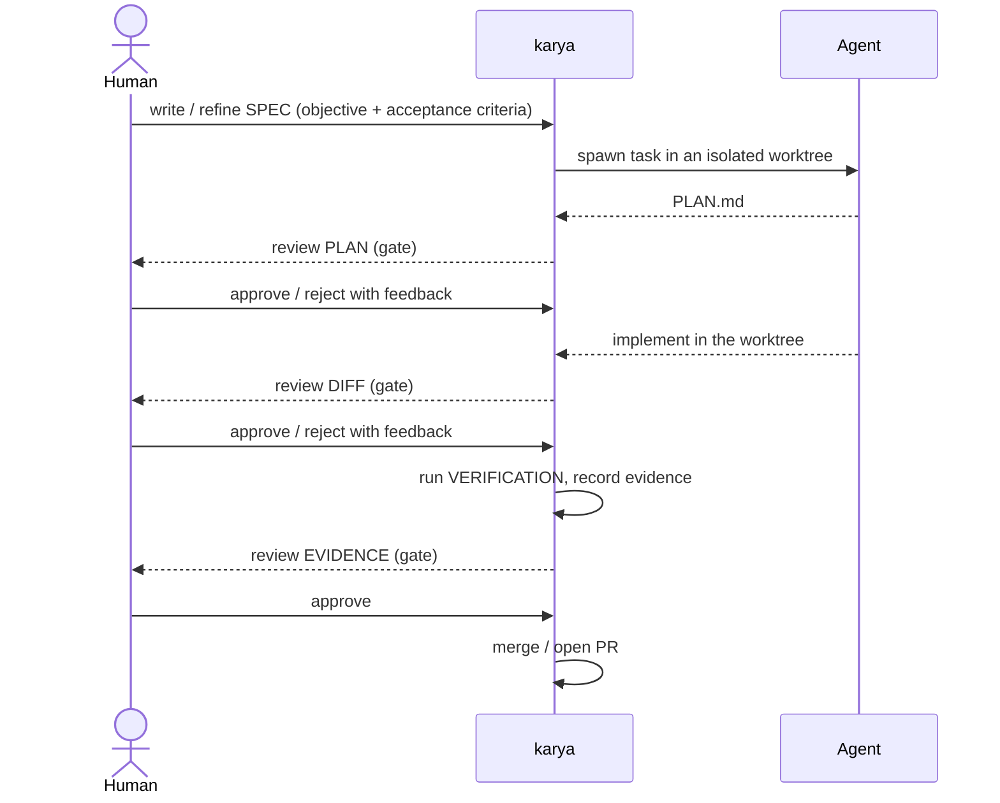
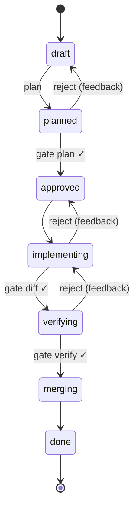
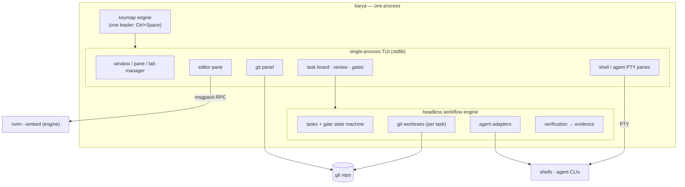
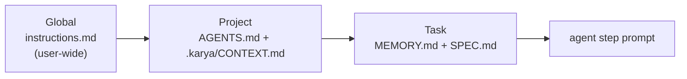

# karya

[](https://github.com/drjzlyan/karya/actions/workflows/ci.yml)
[](LICENSE)
[](https://goreportcard.com/report/github.com/drjzlyan/karya)

**A human-in-the-loop, agent-based IDE in a single terminal binary.**

karya (कार्य — "work/task") is one process that **owns the terminal** — its own
window/pane manager, git panel, and task/review views — and **embeds Neovim as
the editing engine** over msgpack-RPC. Humans set intent and review at explicit
gates; coding agents (Claude, Codex, Crush, Gemini, aider, Copilot) plan,
implement, and verify inside isolated per-task git worktrees. Everything runs
under **one keymap and one leader**, from a single self-contained Go binary —
**without touching any of your existing settings**.

> Status: **actively developed, pre-1.0.** The single-process TUI, embedded
> editor, git panel, task board, review + gates, verification/merge, and
> zero-setup LSP install all work. See [DESIGN.md](DESIGN.md),
> [ROADMAP.md](ROADMAP.md), and [PROGRESS.md](PROGRESS.md).

## Why

Coding agents today are chat panes bolted onto an editor: you paste intent in,
eyeball a wall of diff, and hope the right tests ran. The loop is implicit, the
artifacts are ephemeral, and the IDE is a bundle of separate tools (a
multiplexer, an editor, a git UI) each with its own keymap. karya makes the loop
**explicit and first-class**, and collapses the tool bundle into one program with
one grammar.

## The loop



Every artifact — plan, diff, verification evidence, transcripts, task memory — is
a reviewable file on disk. **Nothing merges without a human gate crossing.** Any
agent CLI can drive any step, through one adapter layer.

## The task gate state machine

A task moves through mandatory gates; rejections loop back to the agent **with
the human's feedback**. Every crossing is recorded (who/what, when, feedback) in
`STATE.json` — the audit trail.



Tasks are an **OKR-shaped contract** (`.karya/tasks/<id>/SPEC.md`): a qualitative
**Objective** plus machine-checkable **Acceptance criteria** (the "key results"),
which karya can *execute* at the verify gate — the agent never self-certifies.

## Architecture

karya is a single process (stdlib-only) that draws its own screen and embeds
Neovim as a headless engine; the workflow engine underneath is fully testable
without a terminal.



## Layered agent instructions

Every agent prompt is assembled from layers that **enhance** (not override) each
other, so guidance composes from user-wide down to the specific task:



An inner layer overrides outer ones only when it says so (`<!-- karya:override -->`).
Because a task's plan, diffs, evidence, transcripts, and `MEMORY.md` are all
agent-agnostic and on disk, you can **swap the agent mid-task without losing
work** — and every agent runs on karya's own isolated tools (LSP, formatters,
runtimes), not whatever is on your global `PATH`.

## Features

- **Human-in-the-loop, agent-agnostic.** Claude, Codex, Crush, Gemini, aider,
  Copilot behind one adapter — mix agents across steps; swap mid-task.
- **One process, one keymap.** karya's own window/pane manager, git panel, and
  task/review views — no tmux, no lazygit — all under `Ctrl+Space`.
- **Neovim embedded as the editor.** Full modal editing, LSP, and treesitter via
  `nvim --embed`; karya renders its grid and routes all input.
- **Zero-setup language servers.** Open a file → its LSP/formatter auto-installs
  into karya's isolated prefix in the background, then attaches.
- **Isolated tasks.** One git worktree + branch per task; agents can't touch your
  working tree until a gate lets work merge.
- **Single Go binary, stdlib only.** No CGO, no runtime deps; fully isolated and
  reversible — `karya uninstall` leaves no trace.

## Zero-impact by design

Installing karya **changes nothing you already have.** It never edits your
`~/.zshrc`, `~/.tmux.conf`, `~/.gitconfig`, or `~/.config/nvim`. The embedded
editor runs under `NVIM_APPNAME=karya/nvim-engine`, and every config, plugin,
tool, and cache lives under karya-owned directories — isolated from your setup
and your global Homebrew/mise. `karya uninstall` removes karya and nothing else.

## Install

Build from source (Go 1.23+):

```bash
git clone https://github.com/drjzlyan/karya
cd karya
make build      # ./bin/karya
```

## Quick start

```bash
# launch the IDE for the current directory (3-pane: editor + agent + build)
karya
# open a file in the embedded editor
karya edit path/to/file
```

> **macOS:** `Ctrl+Space` (the default leader) is often intercepted by the OS
> input-source shortcut. Pick another leader with `KARYA_LEADER`, e.g.
> `KARYA_LEADER=ctrl+a karya`.

Inside the IDE (leader = `Ctrl+Space`, or your `KARYA_LEADER`):

| Keys | Action |
|---|---|
| `<leader> \|` / `-` | split right / down · `h/j/k/l` focus · `H/J/K/L` resize |
| `<leader> g g` | git panel (stage/commit/push) |
| `<leader> t t` | task board · `Enter` review · `a` run an agent in the task worktree |
| `<leader> r` | review the pending gate (`a` approve · `x` reject) |
| `<leader> a` | gate inbox · `<leader> ?` all keys · `<leader> Q` quit |

The task workflow from the CLI:

```bash
karya init                 # scaffold .karya/ + a repo AGENTS.md
karya task new <slug>      # write the spec (objective + acceptance criteria)
karya task start <id>      # isolated worktree on branch task/<id>
karya plan <id>            # agent produces PLAN.md (review at the plan gate)
karya implement <id>       # agent works in the worktree (review the diff)
karya verify <id>          # run the spec's Verification → evidence
karya gate approve <id>    # cross a gate (reject requires feedback)
karya merge <id>           # merge (or --pr) after the verify gate
```

## Documentation

- [DESIGN.md](DESIGN.md) — architecture and the human-in-the-loop design
- [docs/keymaps.md](docs/keymaps.md) — the unified keymap reference
- [docs/commands.md](docs/commands.md) — every command
- [docs/tutorial.md](docs/tutorial.md) — hands-on walkthrough
- [ROADMAP.md](ROADMAP.md) · [PROGRESS.md](PROGRESS.md) — status
- `karya docs`, `karya help <command>`, `karya keys` — offline, in the binary

## Contributing

See [CONTRIBUTING.md](CONTRIBUTING.md) and [AGENTS.md](AGENTS.md) (the
engineering guide). karya is built test-first, stdlib-only, with isolation as the
one rule that governs everything.

## License

[MIT](LICENSE)
